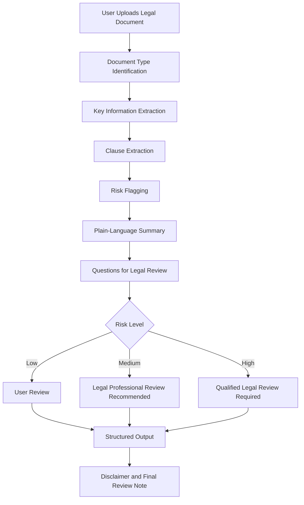

# JurixAI Workflow Diagram

This diagram shows a high-level JurixAI legal document review workflow.

## Design Principle

JurixAI should assist legal professionals and businesses, but it should not replace qualified legal advice.

High-risk legal outputs should always include human professional review.
